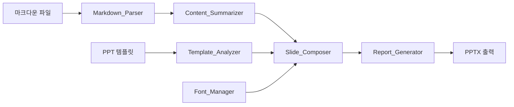
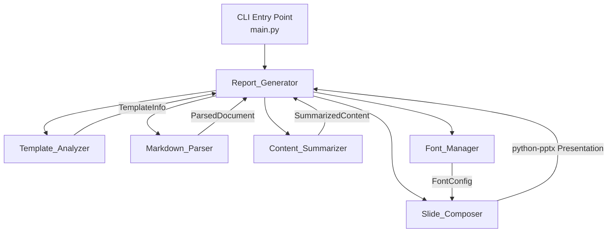
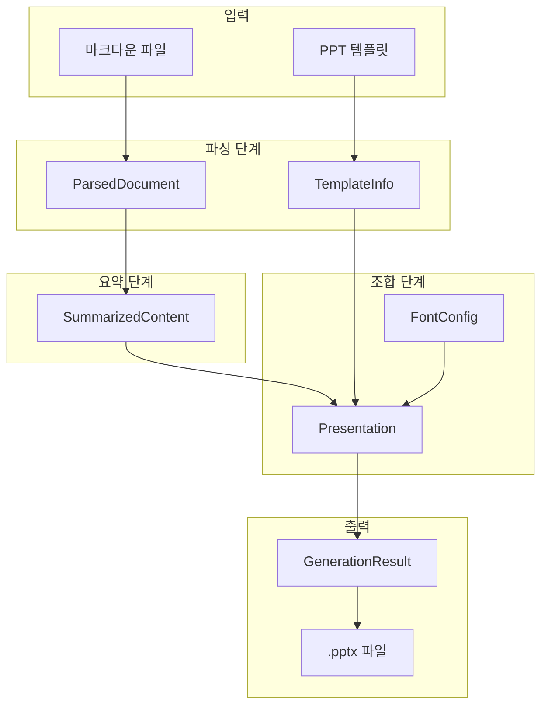

# 설계 문서: md-to-pptx-report-generator

## 개요 (Overview)

마크다운 파일을 분석·요약하여 사용자 제공 PPT 템플릿에 맞는 보고서용 PPTX 파일을 자동 생성하는 Python CLI 도구이다. Amazon Bedrock을 활용한 콘텐츠 요약, 한국어 폰트 지원, 템플릿 기반 레이아웃 배치를 핵심 기능으로 한다.

### 처리 파이프라인



### 기술 스택

| 구분 | 기술 |
|------|------|
| 언어 | Python 3.10+ |
| PPT 생성 | python-pptx |
| 마크다운 파싱 | mistune 3.x |
| AI 요약 | Amazon Bedrock (boto3) |
| CLI | argparse (표준 라이브러리) |
| 테스트 | pytest, hypothesis |

## 아키텍처 (Architecture)

시스템은 6개의 핵심 모듈로 구성되며, 각 모듈은 단일 책임 원칙(SRP)을 따른다. 모듈 간 의존성은 데이터 객체(dataclass)를 통해 전달되어 결합도를 낮춘다.



### 설계 결정 사항

1. **mistune 3.x 선택**: 확장 가능한 AST 기반 파서로, 커스텀 렌더러를 통해 구조화된 데이터 추출이 용이하다. markdown-it-py 대비 가볍고 의존성이 적다.
2. **dataclass 기반 데이터 전달**: 모듈 간 인터페이스를 명확히 정의하고, 타입 힌트를 통해 IDE 지원과 테스트 용이성을 확보한다.
3. **Amazon Bedrock 직접 호출**: LangChain 등 추상화 레이어 없이 boto3로 직접 호출하여 의존성을 최소화한다.
4. **argparse 사용**: 표준 라이브러리만으로 CLI를 구현하여 추가 의존성을 줄인다.


## 컴포넌트 및 인터페이스 (Components and Interfaces)

### 1. Template_Analyzer

PPT 템플릿 파일(.pptx)을 분석하여 레이아웃 구조를 추출한다.

```python
class TemplateAnalyzer:
    def analyze(self, template_path: str) -> TemplateInfo:
        """
        PPTX 템플릿 파일을 분석하여 레이아웃 정보를 반환한다.
        
        Args:
            template_path: PPTX 템플릿 파일 경로
            
        Returns:
            TemplateInfo: 레이아웃 목록과 플레이스홀더 정보
            
        Raises:
            InvalidFileFormatError: 유효하지 않은 파일 형식
            NoPlaceholderWarning: 플레이스홀더가 없는 경우 경고
        """
        ...
```

### 2. Markdown_Parser

마크다운 파일을 파싱하여 구조화된 문서 데이터로 변환한다. mistune 3.x의 AST 모드를 활용한다.

```python
class MarkdownParser:
    def parse(self, markdown_text: str) -> ParsedDocument:
        """
        마크다운 텍스트를 구조화된 문서 객체로 변환한다.
        
        Args:
            markdown_text: 마크다운 원본 텍스트
            
        Returns:
            ParsedDocument: 섹션, 목록, 코드 블록 등 구조화된 데이터
            
        Raises:
            EmptyDocumentError: 빈 마크다운 파일
        """
        ...

    def to_markdown(self, document: ParsedDocument) -> str:
        """
        ParsedDocument를 다시 마크다운 텍스트로 변환한다 (라운드트립 지원).
        """
        ...
```

### 3. Content_Summarizer

Amazon Bedrock API를 호출하여 콘텐츠를 보고서 분량으로 요약한다.

```python
class ContentSummarizer:
    def __init__(self, bedrock_client=None, timeout: int = 30):
        ...

    def summarize(self, document: ParsedDocument, max_slides: int = 5) -> SummarizedContent:
        """
        파싱된 문서를 슬라이드 단위로 요약한다.
        
        Args:
            document: 파싱된 마크다운 문서
            max_slides: 최대 슬라이드 수 (기본 5)
            
        Returns:
            SummarizedContent: 슬라이드별 요약 콘텐츠
            
        Raises:
            BedrockAPIError: API 호출 실패
            BedrockTimeoutError: 30초 타임아웃 초과
        """
        ...
```

### 4. Slide_Composer

요약된 콘텐츠를 템플릿 레이아웃에 맞게 슬라이드에 배치하고 서식을 적용한다.

```python
class SlideComposer:
    def __init__(self, font_manager: FontManager):
        ...

    def compose(
        self,
        template_info: TemplateInfo,
        summarized_content: SummarizedContent,
        template_path: str,
    ) -> Presentation:
        """
        요약 콘텐츠를 템플릿에 배치하여 Presentation 객체를 생성한다.
        
        Args:
            template_info: 템플릿 분석 결과
            summarized_content: 요약된 슬라이드 콘텐츠
            template_path: 원본 템플릿 파일 경로
            
        Returns:
            python-pptx Presentation 객체
        """
        ...
```

### 5. Font_Manager

한국어 폰트 설정 및 적용을 관리한다.

```python
class FontManager:
    DEFAULT_FONT = "맑은 고딕"
    DEFAULT_MONO_FONT = "D2Coding"
    MIN_FONT_SIZE = Pt(10)

    def __init__(self, font_name: str | None = None):
        ...

    def get_font_config(self) -> FontConfig:
        """
        현재 폰트 설정을 반환한다. 지정 폰트가 없으면 기본 폰트를 사용한다.
        """
        ...

    def is_font_available(self, font_name: str) -> bool:
        """시스템에 폰트가 설치되어 있는지 확인한다."""
        ...
```

### 6. Report_Generator

전체 파이프라인을 조율하고 CLI 인터페이스를 제공한다.

```python
class ReportGenerator:
    def generate(
        self,
        template_path: str,
        markdown_path: str,
        output_path: str | None = None,
        font_name: str | None = None,
    ) -> GenerationResult:
        """
        마크다운 파일과 PPT 템플릿으로 보고서 PPTX를 생성한다.
        
        Args:
            template_path: PPT 템플릿 파일 경로
            markdown_path: 마크다운 파일 경로
            output_path: 출력 파일 경로 (None이면 자동 생성)
            font_name: 한국어 폰트명 (None이면 기본 폰트)
            
        Returns:
            GenerationResult: 파일 경로, 슬라이드 수, 소요 시간
        """
        ...
```


## 데이터 모델 (Data Models)

모듈 간 데이터 전달에 사용되는 핵심 데이터 클래스를 정의한다. 모든 모델은 `dataclasses`를 사용하며 불변(frozen) 속성을 권장한다.

```python
from dataclasses import dataclass, field
from enum import Enum
from typing import Optional


# === 템플릿 분석 관련 ===

class PlaceholderType(Enum):
    """플레이스홀더 유형"""
    TITLE = "title"
    SUBTITLE = "subtitle"
    BODY = "body"
    IMAGE = "image"
    TABLE = "table"
    OTHER = "other"


@dataclass(frozen=True)
class PlaceholderInfo:
    """개별 플레이스홀더 정보"""
    idx: int                          # 플레이스홀더 인덱스
    type: PlaceholderType             # 유형
    name: str                         # 이름
    left: int                         # 좌측 위치 (EMU)
    top: int                          # 상단 위치 (EMU)
    width: int                        # 너비 (EMU)
    height: int                       # 높이 (EMU)


@dataclass(frozen=True)
class LayoutInfo:
    """슬라이드 레이아웃 정보"""
    name: str                         # 레이아웃 이름
    index: int                        # 레이아웃 인덱스
    placeholders: list[PlaceholderInfo] = field(default_factory=list)


@dataclass(frozen=True)
class TemplateInfo:
    """템플릿 분석 결과"""
    layouts: list[LayoutInfo]         # 레이아웃 목록
    slide_width: int                  # 슬라이드 너비 (EMU)
    slide_height: int                 # 슬라이드 높이 (EMU)


# === 마크다운 파싱 관련 ===

class NodeType(Enum):
    """마크다운 노드 유형"""
    HEADING = "heading"
    PARAGRAPH = "paragraph"
    ORDERED_LIST = "ordered_list"
    UNORDERED_LIST = "unordered_list"
    LIST_ITEM = "list_item"
    CODE_BLOCK = "code_block"
    TABLE = "table"
    INLINE_CODE = "inline_code"
    BOLD = "bold"
    ITALIC = "italic"
    TEXT = "text"


@dataclass
class MarkdownNode:
    """마크다운 AST 노드"""
    type: NodeType
    content: str = ""
    level: int = 0                    # 제목 레벨(1~6) 또는 목록 중첩 깊이
    children: list["MarkdownNode"] = field(default_factory=list)
    language: str = ""                # 코드 블록 언어


@dataclass
class Section:
    """마크다운 섹션 (제목 + 하위 콘텐츠)"""
    title: str
    level: int                        # 제목 레벨 (1~6)
    nodes: list[MarkdownNode] = field(default_factory=list)


@dataclass
class ParsedDocument:
    """파싱된 마크다운 문서"""
    title: str                        # 문서 제목 (첫 번째 h1)
    sections: list[Section] = field(default_factory=list)


# === 요약 관련 ===

@dataclass(frozen=True)
class SlideContent:
    """개별 슬라이드 콘텐츠"""
    title: str                        # 슬라이드 제목
    body: list[str]                   # 본문 항목 목록
    is_cover: bool = False            # 표지 슬라이드 여부
    notes: str = ""                   # 발표자 노트


@dataclass(frozen=True)
class SummarizedContent:
    """요약된 전체 콘텐츠"""
    slides: list[SlideContent]        # 슬라이드 목록 (최대 5개)
    original_title: str               # 원본 문서 제목


# === 폰트 관련 ===

@dataclass(frozen=True)
class FontConfig:
    """폰트 설정"""
    korean_font: str                  # 한국어 폰트명
    mono_font: str                    # 고정폭 폰트명
    title_size_pt: int = 28           # 제목 폰트 크기
    body_size_pt: int = 16            # 본문 폰트 크기
    code_size_pt: int = 12            # 코드 폰트 크기
    min_size_pt: int = 10             # 최소 폰트 크기


# === 결과 관련 ===

@dataclass(frozen=True)
class GenerationResult:
    """PPTX 생성 결과"""
    output_path: str                  # 출력 파일 경로
    slide_count: int                  # 생성된 슬라이드 수
    elapsed_seconds: float            # 처리 소요 시간 (초)
    warnings: list[str] = field(default_factory=list)  # 경고 메시지 목록
```

### 데이터 흐름




## 정확성 속성 (Correctness Properties)

*속성(property)이란 시스템의 모든 유효한 실행에서 참이어야 하는 특성 또는 동작이다. 속성은 사람이 읽을 수 있는 명세와 기계가 검증할 수 있는 정확성 보장 사이의 다리 역할을 한다.*

### Property 1: 템플릿 분석 정확성

*For any* 유효한 PPTX 템플릿 파일에 대해, Template_Analyzer가 반환하는 TemplateInfo의 레이아웃 수는 원본 템플릿의 슬라이드 레이아웃 수와 일치해야 하며, 각 레이아웃의 플레이스홀더 수와 유형도 원본과 일치해야 한다.

**Validates: Requirements 1.1, 1.2**

### Property 2: 마크다운 파싱 라운드트립

*For any* 유효한 마크다운 텍스트에 대해, `parse(text)`로 ParsedDocument를 생성한 후 `to_markdown(document)`로 다시 텍스트로 변환하고, 이를 다시 `parse()`하면 원본 ParsedDocument와 의미적으로 동등한 결과를 생성해야 한다.

**Validates: Requirements 2.5**

### Property 3: 마크다운 파싱 구조 보존

*For any* 제목, 본문, 순서/비순서 목록, 코드 블록, 표, 인라인 서식을 포함하는 마크다운 텍스트에 대해, Markdown_Parser는 각 요소의 NodeType을 올바르게 분류하고, 중첩 목록의 깊이를 보존하며, 인라인 서식(bold, italic, code) 정보를 유지해야 한다.

**Validates: Requirements 2.1, 2.2, 2.3**

### Property 4: 슬라이드 수 범위 제약

*For any* ParsedDocument에 대해, Content_Summarizer가 반환하는 SummarizedContent의 슬라이드 수는 항상 1 이상 5 이하여야 한다.

**Validates: Requirements 3.3, 7.1, 7.2**

### Property 5: 첫 슬라이드 표지 구성

*For any* SummarizedContent에 대해, 첫 번째 SlideContent의 `is_cover` 속성은 항상 True여야 한다.

**Validates: Requirements 7.3**

### Property 6: 잘못된 입력 파일 오류 처리

*For any* 유효하지 않은 파일 형식(비-PPTX) 또는 존재하지 않는 파일 경로에 대해, 시스템은 적절한 오류 메시지를 포함한 예외를 발생시켜야 한다.

**Validates: Requirements 1.3, 8.4**

### Property 7: Bedrock API 오류 전파

*For any* Bedrock API 호출 실패 상황에 대해, Content_Summarizer는 오류 코드와 메시지를 포함한 BedrockAPIError를 발생시켜야 한다.

**Validates: Requirements 3.5**

### Property 8: 슬라이드 콘텐츠 배치 완전성

*For any* SummarizedContent와 TemplateInfo 조합에 대해, Slide_Composer가 생성하는 Presentation의 슬라이드 수는 SummarizedContent의 슬라이드 수와 일치해야 하며, 각 슬라이드의 플레이스홀더에 해당 콘텐츠가 배치되어야 한다.

**Validates: Requirements 4.1**

### Property 9: 슬라이드 서식 속성 일관성

*For any* 생성된 슬라이드에 대해, 본문 텍스트의 줄간격은 1.2~1.5배 범위이고, 제목 폰트 크기는 본문 폰트 크기보다 크며, 제목은 중앙 정렬이고 본문은 좌측 정렬이어야 한다.

**Validates: Requirements 4.2, 4.4, 9.1**

### Property 10: 인라인 서식 변환

*For any* 굵게(bold) 또는 기울임(italic) 서식이 포함된 콘텐츠에 대해, Slide_Composer가 생성한 PPT의 해당 텍스트 run에는 각각 bold=True 또는 italic=True 속성이 설정되어야 한다.

**Validates: Requirements 4.7**

### Property 11: 목록 들여쓰기 깊이 보존

*For any* 중첩 목록이 포함된 콘텐츠에 대해, Slide_Composer가 생성한 PPT의 목록 항목 들여쓰기 레벨은 원본 마크다운의 중첩 깊이와 일치해야 한다.

**Validates: Requirements 4.3**

### Property 12: 코드 블록 고정폭 폰트 적용

*For any* 코드 블록이 포함된 콘텐츠에 대해, Slide_Composer가 생성한 PPT의 코드 블록 텍스트에는 고정폭 폰트(monospace)가 적용되어야 한다.

**Validates: Requirements 9.3**

### Property 13: 표 데이터 변환

*For any* 표(table) 데이터가 포함된 콘텐츠에 대해, Slide_Composer가 생성한 PPT에는 해당 표가 PPT 표 객체로 존재하며, 헤더 행에는 배경색이 적용되어야 한다.

**Validates: Requirements 9.4**

### Property 14: 페이지 번호 삽입

*For any* 생성된 PPTX의 모든 슬라이드에 대해, 슬라이드 하단에 페이지 번호가 존재해야 한다.

**Validates: Requirements 9.5**

### Property 15: 텍스트 박스 비겹침

*For any* 생성된 슬라이드에 대해, 슬라이드 내 모든 텍스트 박스 쌍의 영역(bounding box)은 서로 겹치지 않아야 한다.

**Validates: Requirements 9.6**

### Property 16: 사용자 지정 폰트 우선 적용

*For any* 유효한 폰트명이 지정된 경우, Font_Manager가 반환하는 FontConfig의 korean_font는 지정된 폰트명과 일치해야 한다.

**Validates: Requirements 5.2**

### Property 17: 미설치 폰트 기본값 대체

*For any* 시스템에 설치되지 않은 폰트명이 지정된 경우, Font_Manager는 경고를 발생시키고 FontConfig의 korean_font를 기본 폰트("맑은 고딕")로 설정해야 한다.

**Validates: Requirements 5.3**

### Property 18: PPTX 파일 유효성 라운드트립

*For any* Report_Generator가 생성한 PPTX 파일에 대해, python-pptx로 다시 로드했을 때 오류 없이 열리고, 슬라이드 수가 SummarizedContent의 슬라이드 수와 일치해야 한다.

**Validates: Requirements 6.1**

### Property 19: 출력 파일명 자동 생성 규칙

*For any* 마크다운 파일명에 대해, 출력 경로가 지정되지 않으면 생성되는 파일명은 "{마크다운파일명(확장자 제외)}_report.pptx" 형식이어야 한다.

**Validates: Requirements 6.3**

### Property 20: 생성 결과 완전성

*For any* 성공적인 PPTX 생성에 대해, GenerationResult는 output_path(비어있지 않은 문자열), slide_count(1 이상), elapsed_seconds(0 이상)를 포함해야 한다.

**Validates: Requirements 6.5**

### Property 21: CLI 인자 파싱 정확성

*For any* 유효한 CLI 인자 조합(필수: 템플릿 경로, 마크다운 경로 / 선택: 출력 경로, 폰트명)에 대해, argparse가 반환하는 Namespace 객체의 각 필드는 입력 인자와 일치해야 한다.

**Validates: Requirements 8.2**


## 오류 처리 (Error Handling)

### 커스텀 예외 계층

```python
class ReportGeneratorError(Exception):
    """보고서 생성기 기본 예외"""
    pass


class InvalidFileFormatError(ReportGeneratorError):
    """유효하지 않은 파일 형식 (요구사항 1.3)"""
    def __init__(self, path: str):
        super().__init__(f"지원하지 않는 파일 형식입니다: {path}")


class FileNotFoundError(ReportGeneratorError):
    """파일을 찾을 수 없음 (요구사항 8.4)"""
    def __init__(self, path: str):
        super().__init__(f"파일을 찾을 수 없습니다: {path}")


class EmptyDocumentError(ReportGeneratorError):
    """빈 마크다운 파일 (요구사항 2.4)"""
    def __init__(self):
        super().__init__("마크다운 파일에 내용이 없습니다")


class NoPlaceholderWarning(UserWarning):
    """플레이스홀더 없음 경고 (요구사항 1.4)"""
    def __init__(self):
        super().__init__("템플릿에 사용 가능한 플레이스홀더가 없습니다")


class BedrockAPIError(ReportGeneratorError):
    """Bedrock API 호출 실패 (요구사항 3.5)"""
    def __init__(self, error_code: str, retryable: bool = False):
        msg = f"Bedrock API 호출에 실패했습니다 (코드: {error_code})"
        if retryable:
            msg += " - 재시도 가능"
        super().__init__(msg)
        self.error_code = error_code
        self.retryable = retryable


class BedrockTimeoutError(BedrockAPIError):
    """Bedrock API 타임아웃 (요구사항 3.6)"""
    def __init__(self):
        super().__init__(error_code="TIMEOUT", retryable=True)


class ContentOverflowWarning(UserWarning):
    """콘텐츠 영역 초과 경고 (요구사항 4.6)"""
    def __init__(self, slide_index: int):
        super().__init__(
            f"슬라이드 {slide_index}: 콘텐츠가 플레이스홀더 영역을 초과합니다"
        )


class FontNotFoundWarning(UserWarning):
    """폰트 미설치 경고 (요구사항 5.3)"""
    def __init__(self, font_name: str):
        super().__init__(
            f"지정된 폰트를 찾을 수 없습니다. 기본 폰트(맑은 고딕)를 사용합니다: {font_name}"
        )
```

### 오류 처리 전략

| 모듈 | 오류 상황 | 처리 방식 | 요구사항 |
|------|-----------|-----------|----------|
| Template_Analyzer | 유효하지 않은 파일 형식 | `InvalidFileFormatError` 발생 | 1.3 |
| Template_Analyzer | 플레이스홀더 없음 | `NoPlaceholderWarning` 경고 발행 | 1.4 |
| Markdown_Parser | 빈 마크다운 파일 | `EmptyDocumentError` 발생 | 2.4 |
| Content_Summarizer | Bedrock API 실패 | `BedrockAPIError` 발생 (재시도 여부 포함) | 3.5 |
| Content_Summarizer | 30초 타임아웃 | `BedrockTimeoutError` 발생 | 3.6 |
| Slide_Composer | 콘텐츠 영역 초과 | `ContentOverflowWarning` 경고 기록 | 4.6 |
| Font_Manager | 폰트 미설치 | `FontNotFoundWarning` 경고 + 기본 폰트 대체 | 5.3 |
| Report_Generator | 입력 파일 미존재 | `FileNotFoundError` 발생 | 8.4 |
| Report_Generator | 출력 파일 중복 | 사용자 확인 요청 (CLI 프롬프트) | 6.4 |

### 경고 vs 예외 구분

- **예외(Exception)**: 처리를 계속할 수 없는 치명적 오류. 프로그램 실행을 중단한다.
- **경고(Warning)**: 처리는 계속 가능하지만 사용자에게 알려야 하는 상황. `warnings` 모듈을 사용하여 발행하고, `GenerationResult.warnings`에 기록한다.


## 테스트 전략 (Testing Strategy)

### 테스트 프레임워크

| 구분 | 도구 | 용도 |
|------|------|------|
| 단위 테스트 | pytest | 구체적 예제, 엣지 케이스, 오류 조건 |
| 속성 기반 테스트 | hypothesis | 범용 속성 검증 (최소 100회 반복) |
| 모킹 | unittest.mock | Bedrock API 등 외부 의존성 격리 |

### 이중 테스트 접근법

단위 테스트와 속성 기반 테스트는 상호 보완적이며, 둘 다 필요하다.

- **단위 테스트**: 구체적인 예제와 엣지 케이스를 검증한다. 특정 입력에 대한 기대 출력을 확인한다.
- **속성 기반 테스트**: 모든 유효한 입력에 대해 보편적 속성이 성립하는지 검증한다. 무작위 입력 생성을 통해 예상치 못한 버그를 발견한다.

### 속성 기반 테스트 설정

- 각 속성 테스트는 최소 100회 반복 실행한다 (`@settings(max_examples=100)`)
- 각 테스트에는 설계 문서의 속성 번호를 참조하는 태그를 포함한다
- 태그 형식: `Feature: md-to-pptx-report-generator, Property {번호}: {속성 설명}`
- 각 정확성 속성은 하나의 속성 기반 테스트로 구현한다

### 모듈별 테스트 계획

#### Template_Analyzer 테스트

- **속성 테스트**: Property 1 - 임의의 PPTX 템플릿 생성 후 분석 결과의 레이아웃/플레이스홀더 수 일치 검증
- **속성 테스트**: Property 6 - 임의의 비-PPTX 바이트 시퀀스에 대한 오류 발생 검증
- **단위 테스트**: 플레이스홀더 없는 템플릿에 대한 경고 발생 확인 (엣지 케이스, 요구사항 1.4)

#### Markdown_Parser 테스트

- **속성 테스트**: Property 2 - 임의의 마크다운 텍스트에 대한 parse → to_markdown → parse 라운드트립 검증
- **속성 테스트**: Property 3 - 임의의 마크다운 요소 조합에 대한 NodeType 분류 및 구조 보존 검증
- **단위 테스트**: 빈 마크다운 파일에 대한 EmptyDocumentError 발생 확인 (엣지 케이스, 요구사항 2.4)

#### Content_Summarizer 테스트

- **속성 테스트**: Property 4 - mock된 Bedrock 응답으로 슬라이드 수 1~5 범위 검증
- **속성 테스트**: Property 5 - 첫 슬라이드 is_cover=True 검증
- **속성 테스트**: Property 7 - mock된 Bedrock 오류 응답에 대한 BedrockAPIError 발생 검증
- **단위 테스트**: 30초 타임아웃 시 BedrockTimeoutError 발생 확인 (엣지 케이스, 요구사항 3.6)

#### Slide_Composer 테스트

- **속성 테스트**: Property 8 - 임의의 콘텐츠/템플릿 조합에 대한 슬라이드 수 일치 및 콘텐츠 배치 검증
- **속성 테스트**: Property 9 - 줄간격(1.2~1.5), 폰트 크기 계층, 텍스트 정렬 일관성 검증
- **속성 테스트**: Property 10 - bold/italic 서식 변환 검증
- **속성 테스트**: Property 11 - 중첩 목록 들여쓰기 레벨 보존 검증
- **속성 테스트**: Property 12 - 코드 블록 고정폭 폰트 적용 검증
- **속성 테스트**: Property 13 - 표 객체 변환 및 헤더 배경색 검증
- **속성 테스트**: Property 14 - 모든 슬라이드 페이지 번호 존재 검증
- **속성 테스트**: Property 15 - 텍스트 박스 영역 비겹침 검증
- **단위 테스트**: 최소 폰트 크기(10pt)까지 축소 후에도 초과 시 경고 기록 확인 (엣지 케이스, 요구사항 4.6)

#### Font_Manager 테스트

- **속성 테스트**: Property 16 - 임의의 폰트명 지정 시 FontConfig 반영 검증
- **속성 테스트**: Property 17 - 미설치 폰트명에 대한 기본 폰트 대체 검증
- **단위 테스트**: 기본 폰트가 "맑은 고딕"인지 확인 (예제, 요구사항 5.1)

#### Report_Generator 테스트

- **속성 테스트**: Property 18 - 생성된 PPTX 파일의 python-pptx 재로드 검증
- **속성 테스트**: Property 19 - 임의의 마크다운 파일명에 대한 출력 파일명 형식 검증
- **속성 테스트**: Property 20 - GenerationResult 필드 완전성 검증
- **속성 테스트**: Property 21 - 임의의 CLI 인자 조합에 대한 파싱 정확성 검증
- **단위 테스트**: CLI 실행 가능 여부 확인 (예제, 요구사항 8.1)
- **단위 테스트**: 필수 인자 누락 시 사용법 출력 확인 (엣지 케이스, 요구사항 8.3)
- **단위 테스트**: 출력 파일 중복 시 확인 요청 확인 (엣지 케이스, 요구사항 6.4)

### Hypothesis 전략 (Strategy)

마크다운 텍스트, PPTX 템플릿, CLI 인자 등 복잡한 입력 데이터를 생성하기 위해 Hypothesis의 커스텀 전략(strategy)을 정의한다.

```python
from hypothesis import strategies as st

# 마크다운 텍스트 생성 전략
markdown_text = st.text(min_size=1).map(lambda t: f"# 제목\n\n{t}")

# 슬라이드 콘텐츠 생성 전략
slide_content = st.builds(
    SlideContent,
    title=st.text(min_size=1, max_size=100),
    body=st.lists(st.text(min_size=1, max_size=200), min_size=1, max_size=10),
    is_cover=st.booleans(),
)

# CLI 인자 생성 전략
cli_args = st.fixed_dictionaries({
    "template": st.text(min_size=1, max_size=50).map(lambda t: f"{t}.pptx"),
    "markdown": st.text(min_size=1, max_size=50).map(lambda t: f"{t}.md"),
    "output": st.one_of(st.none(), st.text(min_size=1, max_size=50).map(lambda t: f"{t}.pptx")),
    "font": st.one_of(st.none(), st.text(min_size=1, max_size=30)),
})
```

